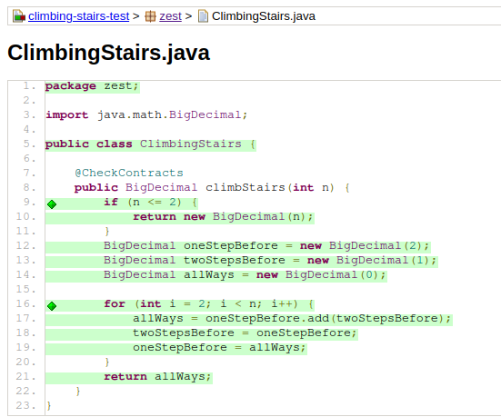
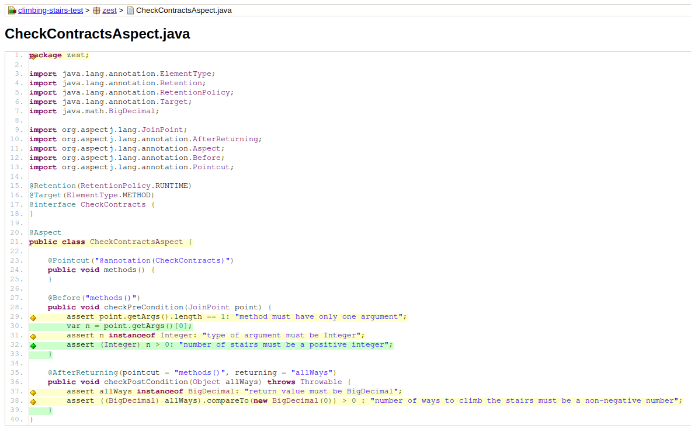

# Solution - Climbing Stairs

## Task 1: Code Coverage

As you can see from the screenshots, the coverage of the target code is 100%. The coverage of the aspect is not 100% because some dummy code is added to check what is checked by the compiler during the compilation process, and these cannot be checked by the testsuite.

## Task 2: Designing Contracts

- **Pre-Conditions:**
  - Given n will be a positive integer.
- **Post-Conditions:** 
  - The return value must be a non-negative integer.
- **Invariants:**
  - None

To ensure these contracts, I created a class `CheckContractAspect`, which is an AOP Aspect class, including two Advices, in which one is checking the pre-conditions, while the other one is checking the post-conditions. For each method annotated with `CheckContracts` annotation (only the solution method applies), this aspect will perform checks before and after its invocation.

The advice that checks pre-conditions ensures:
1. There's only one input argument;
2. The only argument is of type `Integer`;
3. The only argument is positive. 

The advice that checks post-conditions ensures:
1. The return value is of type `BigDecimal`;
2. The return value is non-negative.

Note that the original return type `long` is not sufficient for input as large as `(int) 1e6`, while it is, however, a perfectly valid input. As a result, I had to change the return type to `BigDecimal` which supports larger integers.

## Task 3: Testing Contracts

Two property-based tests are carried out to test pre- and post-conditions:

1. Property `testPreConditions` tests the pre-condition checking code. It tries to populate the input argument with invalid values (negative integers, in this case), and expects an `AssertionError` to be thrown.
2. Property `testPostConditions` tests if the solution code satisfied with the post-conditions. It feeds the solution method with random valid inputs, and asserts that the return value is non-negative.

## Task 4: Property-Based Testing

The property that should be hold true for any input greater than `3` is that, the number of ways to advance `n` stairs, is equal to the sum of the number of ways to advance `n-1` stairs and the number of ways to advance `n-2` stairs. A test method `equalsToOneBeforePlusTwoBefore` is derived for this property.

Two example-based test cases are also added to the test suite, to cover the entire valid input range, namely `1` and `2`. These cases are placed inside the `exampleBasedTests` method.
