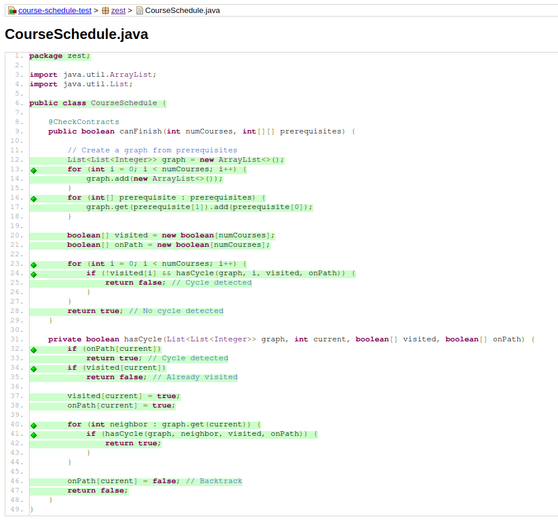
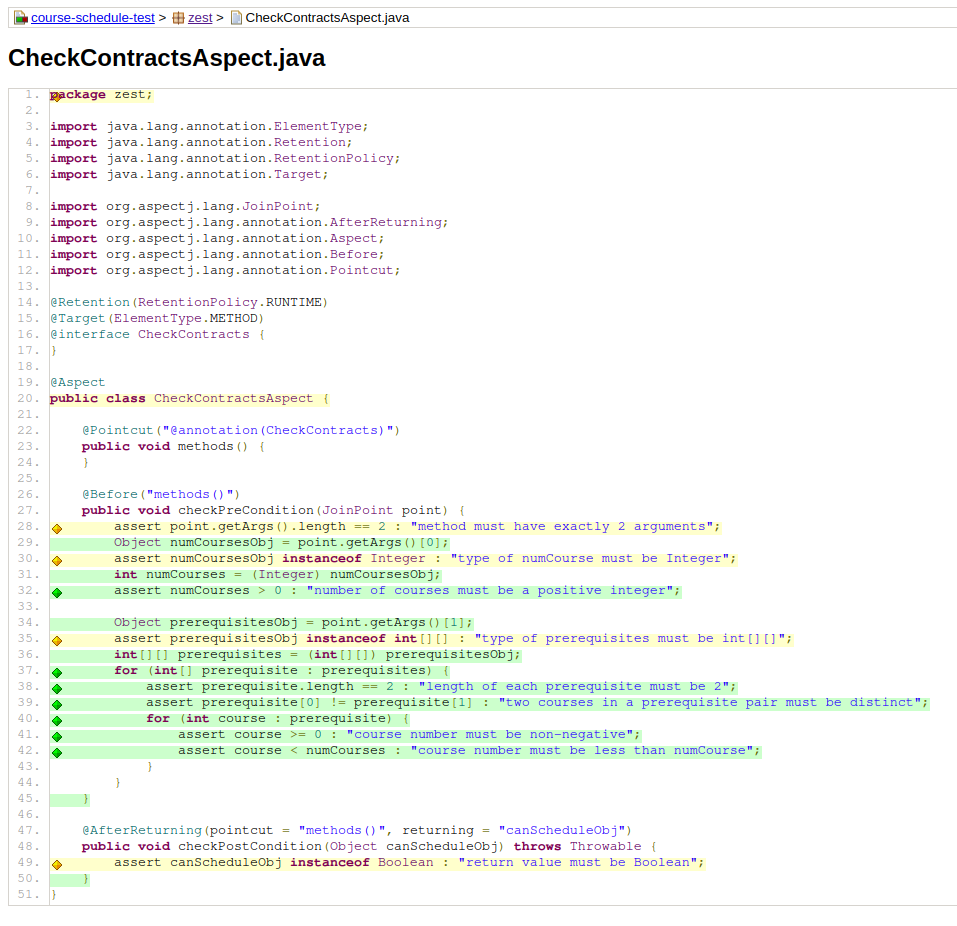

# Solution - Course Schedule

## Task 1: Code Coverage

As you can see from the screenshots, the coverage of the target code is 100%. The coverage of the aspect is not 100% because some dummy code is added to check what is checked by the compiler during the compilation process, and these cannot be checked by the testsuite.

## Task 2: Designing Contracts

- **Pre-Conditions:**
  - Given `numCourses` will be a positive integer.
  - Each element in given `prerequisites` will be an array of integer of length exactly 2.
  - Each element in each element in given `prerequisites` will be a positive integer and less than `numCourses`.
  - Elements in each prerequisite pair will be distinct.
- **Post-Conditions:** 
  - The return value must be a boolean.
- **Invariants:**
  - `prerequisites` will not be modified.

To ensure these contracts, I created a class `CheckContractAspect`, which is an AOP Aspect class, including two Advices, in which one is checking the pre-conditions, while the other one is checking the post-conditions. For each method annotated with `CheckContracts` annotation (only the solution method applies), this aspect will perform checks before and after its invocation.

The advice that checks pre-conditions ensures:
1. There are exactly 2 input arguments;
2. The type of the first argument is `Integer`;
3. The first argument is positive;
4. The type of the second argument is `int[][]`;
5. The length of each element of the second argument is exactly 2;
6. Each element of each element of the second argument is positive and is less than the first argument;
7. Elements in each element of the second argument is distinct;

The advice that checks post-conditions ensures:
1. The return value is of type `Boolean`;

## Task 3: Testing Contracts

Post-conditions are checked by the compiler, so no test for post-conditions is provided.

Several property-based tests are carried out to test pre-conditions:
1. property `testPreConditionsNumCourses` tests if non-positive integer is accepted for argument 1;
2. property `testPreConditionsPrerequisitesNegativeValue` checks if negative value in prerequisites leads to `AssertionError` being thrown;
3. property `testPreConditionsPrerequisitesNonExistCourse` checks if value larger than `numCourse` in prerequisites leads to `AssertionError` being thrown;
4. property `testPreConditionsPrerequisitesInvalidShape` checks if prerequisite of length other than 2 leads to `AssertionError` being thrown;
5. property `testPreConditionsPrerequisitesDistinctCourse` checks if two identical courses in a single prerequisite pair leads to `AssertionError` being thrown;

## Task 4: Property-Based Testing

The method should hold for 2 properties:

1. If the courses shape a forest, they should be able to be scheduled;
2. If the courses shape a (disconnected) graph with cycles, they should not be able to be scheduled.

Two property-based tests are carried out for these properties:

1. `forestsCanBeScheduled` is for the first property, which constructs a random forest, and expects it can be scheduled;
2. `graphsWithCycleCannotBeScheduled` is for the second property, which constructs a graph with a cycle of random size, and expects it can not be scheduled.

To implement these two tests, a helper class `GraphNode` is built to represent graph structure.