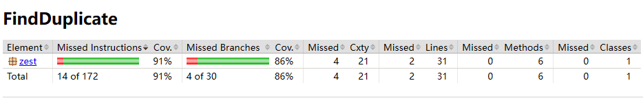
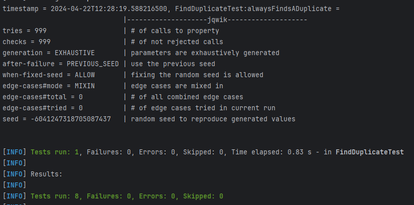

# Problem: Find the Duplicate Number
## Code Coverage
91% lines are covered, 2 lines are not covered.
1. Post-condition: `assert isElementOf(nums, hare) ...`
2. Invariant: `assert isUnchanged(nums) ...`

These two lines of code are post-condition and invariant check, which are An errors that normally does not occur unless the value has been tampered with.
In other words, it cannot be covered by normal test suites, while other lines are fully covered.

## Designing Contracts
1. Pre-conditions:

   The input array nums should not be null.
   
   The length of nums should be at least `2` (as per problem statement, size is `n + 1` and `n ≥ 1`).

   Array elements should be within the specified range `[1,n](inclusive)`.
2. Post-conditions:

   The output should be a valid integer from the input array.

3. Invariants:

   The array nums should not be modified by the function.

## Updated Java Code with Contracts

## Key Properties
properties that should hold true:
1. Existence of a Duplicate: 

For any input array conforming to the specifications (each integer between 1 and n, inclusive, in an array of size n+1), there must be at least one duplicate.
2. Duplicate Validity: 

The value returned by findDuplicate must always be one of the elements in the input array.

Result of Property-based Test:
A `@Provide arraysWithDuplicates()` is written to generate random arrays size (2,1000),
and add a duplicate number from the array to ensure a duplicate number in the test array.
`@Property  alwaysFindsADuplicate()` is written to test the result, and `isDuplicate()` to check whether the result is valid.

100% tries (1000 times) of jqwik tests passed, therefore the test is considered successful

## Screenshots of jacoco code coverage and property-based test result:

