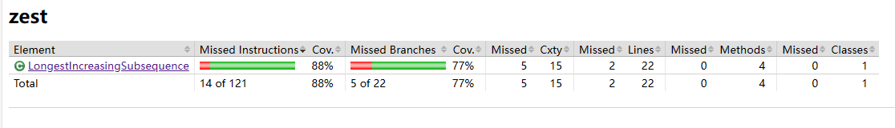
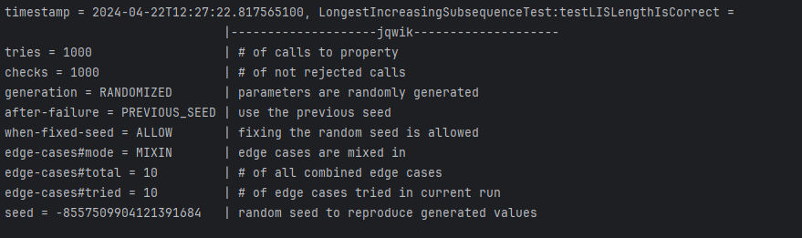

# Problem: Longest Increasing Subsequence
## Code Coverage
88% lines are covered, 2 lines are not covered.
1. Post-condition: `assert maxLength >= 0 && maxLength <= nums.length` to check whether subsequence length is valid.
2. Invariant: `assert isUnchanged(nums) ` to check whether the input array has been modified
   
Similar to Problem 3, These two lines of code are post-condition and invariant check, which are An errors that normally does not occur unless the value has been tampered with.
   In other words, it cannot be covered by normal test suites, while other lines are fully covered.
## Designing Contracts
For the LongestIncreasingSubsequence class and its method lengthOfLIS, we can define and document the following contracts:

1. Pre-Conditions:

   The input array of nums must not be null. 

2. Post-Conditions:

   The returned value must be a non-negative integer.

   The returned value must not exceed the length of the input array (valid length).
3. Invariants:

   The input array nums should remain unchanged throughout the method execution. 

## Updated Java Code with Contracts

## Key Properties
properties that should hold true:
1. LIS Length is valid:

   The length of the LIS should be non-negative.

   The length of the LIS must not exceed the length of the input array.

2. LIS content is valid:
   The LIS length computed should correspond to an actual increasing subsequence found within the array.
   

Result of Property-based Test:

   A `@Provide Arbitrary<int[]> arrays()` is written to generate random arrays size [0,100],
   `testLISLengthIsCorrect` is written to test the result, by assertions of the three properties.

   100% tries (1000 times) of jqwik tests passed, therefore the test is considered successful

## Screenshots of jacoco code coverage and property-based test result:

