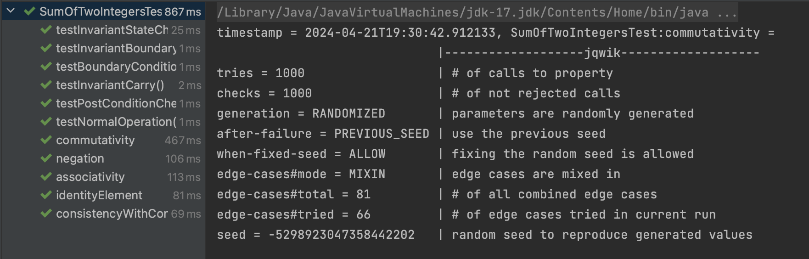

# Problem: Sum of Two Integers

## Code Coverage


## Designing Contracts

1. Pre-conditions:

   The inputs both ```a```nd ```b``` are within the 32-bit signed integer range.

2. Post-conditions:

   The output value is equivalent to `a + b`

3. Invariants:

   \- carry contains the common set bits of `a` and `b`, shifted left by one position.     

   \-a contains the sum of bits of `a` and `b` where at least one bit is not set.     

   \-b contains the carry, to be added in the next iteration.

## Updated Java Code with Contracts

## Property-Based Testing

### Commutativity Property

**Description**: This property checks if the addition operation is commutative. Commutativity means that the order of the operands doesn't matter; the result should be the same.

**Reason**: Commutativity is a fundamental property of addition. This property ensures that the sum of two integers is independent of their order, verifying that `getSum(a, b)` should equal `getSum(b, a)`.

### Associativity Property

**Description**: This property checks if the addition operation is associative. Associativity implies that when adding three numbers, the grouping doesn't affect the outcome.

**Reason**: Associativity is crucial for correct addition behavior. This test ensures that the way numbers are grouped for addition doesn't alter the result, validating that `getSum(a, getSum(b, c))` is equivalent to `getSum(getSum(a, b), c)`.

### Identity Element Property

**Description**: This property checks if zero is an identity element for addition. An identity element leaves a number unchanged when added to it.

**Reason**: The identity element for addition is zero. This test validates that adding zero to any number results in the same number, ensuring that `getSum(a, 0)` is equivalent to `a`.

### Negation Property

**Description**: This property checks if adding a number to its negation results in zero. This behavior is expected from arithmetic addition.

**Reason**: Negation is important for operations like subtraction and negative numbers. This test verifies that adding a number to its negation results in zero, ensuring that `getSum(a, -a)` equals zero.

### Consistency with Conventional Addition Property

**Description**: This property checks if the custom addition implementation is consistent with conventional addition within 32-bit integer bounds.

**Reason**: This property ensures that the custom implementation of the addition operation aligns with conventional addition when there's no overflow. By comparing the custom addition result with conventional addition, it ensures that the results are consistent, validating `getSum(a, b)` against traditional addition.

###  100% tries (1000 times) of jqwik tests passed, therefore the test is considered successful



## Note

I used ChatGPT to supplement my ideas. Once it gave me some thoughts, I would reflect on their validity and choose whether to incorporate them.

