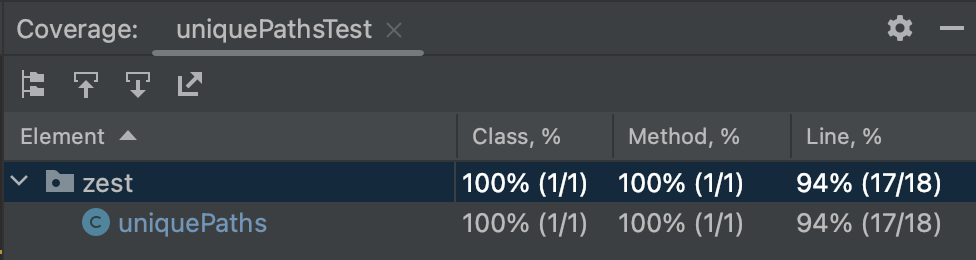
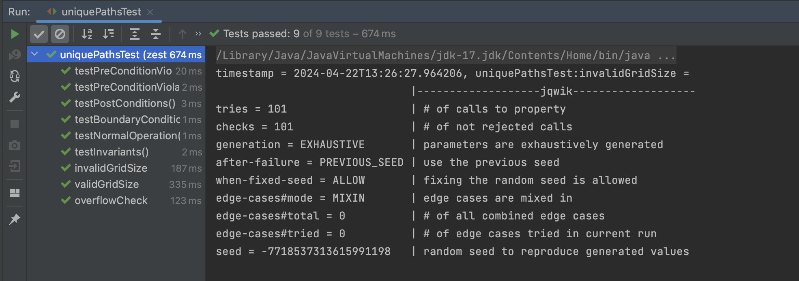

# Problem: Unique Paths in a Grid

## Code Coverage

## Designing Contracts

### Preconditions

1. **Grid Dimensions**:

   - The values of m and n must be positive integers. Specifically:

     `1 <= m <= 100  `

     `1 <= n <= 100`

2. **Movement Constraints**:

   - The robot can only move down or right.

3. **Start and End Points**:

   - The starting point is the top-left corner (i.e., `(0, 0)`).
   - The ending point is the bottom-right corner (i.e., `(m-1, n-1)`).

### Postconditions

1. **Return Value**:
   - The return value must be a non-negative integer representing the total number of unique paths from the top-left corner to the bottom-right corner in the grid.
2. **Path Uniqueness**:
   - The calculated paths must be unique based on the constraint of moving only down or right.

### Invariants

1. **Grid Boundaries**:
   - The movement of the robot should always be within the boundaries of the grid, which is `m x n`.
2. **Uniqueness of Paths**:
   - Given a grid with a specified `m` and `n`, the number of unique paths should not change across different executions with the same input.

## Updated Java Code with Contracts

### Problem

Postcondition, the return value is not negative the test does not pass

### Solution

Set the value to 0 if the value obtained is negative.

## Property-Based Testing

### Key Property

1. Valid range of inputs: Make sure that both m and n are in the range of 1 to 100.
2. Correct output: the number of paths returned should be positive.
3. Unique Path Calculation: Given m rows and n columns, calculate the number of paths as expected.
4. Boundary conditions: Include inputs for minimum and maximum values.
5. Single Row or Single Column: Tests the number of paths if there is only one row or column.

###  100% tries (101/1000 times) of jqwik tests passed, therefore the test is considered successful

## Note

I used ChatGPT to supplement my ideas. Once it gave me some thoughts, I would reflect on their validity and choose whether to incorporate them.

